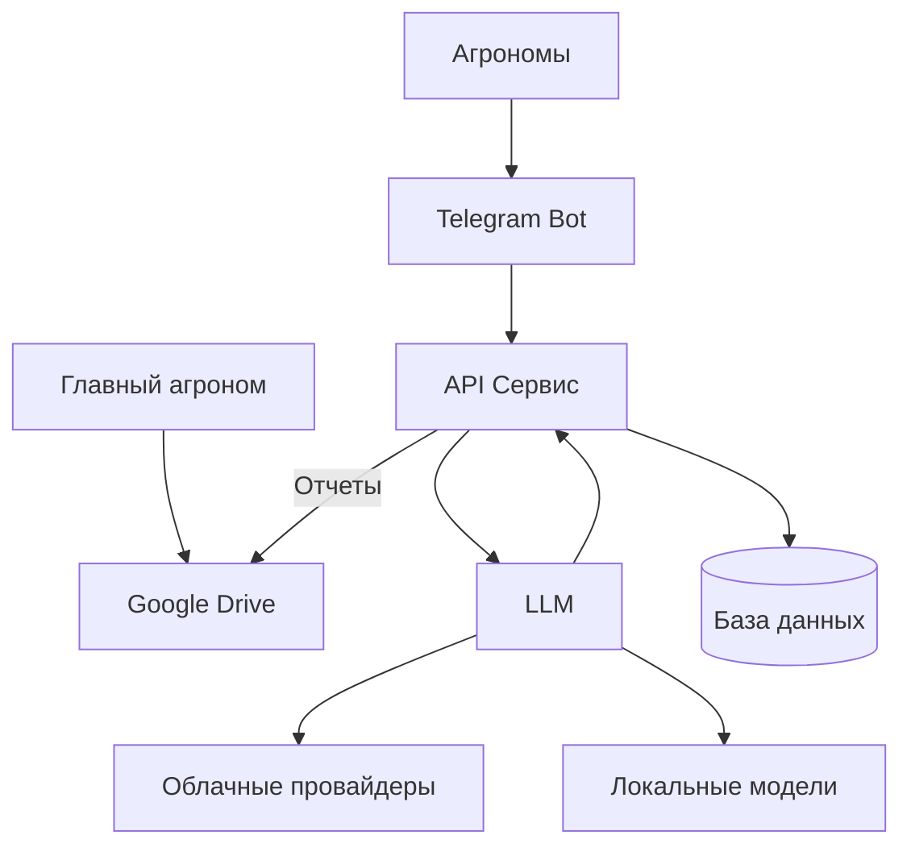

# АгроМейт - интеллектуальный ассистент для агрономов

**Команда**: Нейродрайв  
**Хакатон**: [LLM Coding Challenge](https://llm-challenge.com)  
**Кейс**: ГК «Прогресс Агро» - Сервис структурирования сообщений от агрономов

## О проекте

АгроМейт - интеллектуальный сервис для автоматизации сбора и структурирования полевых отчетов агрономов. Решение автоматизирует процесс извлечения данных из Telegram-сообщений, их классификации и заполнения таблиц с экспортом в Google Drive, освобождая время главного агронома для более важных задач.

## Описание задачи

В компании ГК «Прогресс Агро» работает более 5 000 человек. Сотни агрономов ежедневно отправляют после полевых работ информацию о проделанной работе. Материалы могут приходить поздним вечером в различных форматах - от текстовых сообщений произвольного стиля до скриншотов. Сводная таблица со всеми данными требуется уже утром, что вынуждает главного агронома вручную обрабатывать информацию и вносить её в таблицы с последующим экспортом в Google Drive, приводя к переработкам.

## Демо


## Структура репозитория

```
/
├── agromate/               # Основной код приложения
│   ├── api/                # Основной сервис и API для клиентов по обработке сообщений
│   ├── clients/            # Различные клиенты (мессенджеры и веб-приложения)
│   │   ├── telegram-bot/   # Различные клиенты (мессенджеры и веб-приложения)
│   ├── data/               # Данные (справочники и конфигурационные файлы)
│
└── docs/               # Документация проекта
    ├── ai-usage/       # Использование AI в разработке
    ├── architecture/   # Архитектура системы
    ├── development/    # Руководство для разработчиков
    ├── plan/           # План и дорожная карта
    ├── requirements/   # Функциональные и технические требования
    ├── rules/          # Правила и критерии оценки
    └── user-guides/    # Руководство пользователя
```

## Архитектура

Подробное описание архитектуры системы доступно в [документации по архитектуре](docs/architecture/README.md).



Архитектура АгроМейт разработана с учетом принципов масштабируемости, читаемости и расширяемости. Проект структурирован по функциональным компонентам с четким разделением ответственности между модулями. Каждый компонент имеет собственную область задач, а взаимодействие между ними осуществляется через четко определенные интерфейсы. Такой подход обеспечивает гибкость при добавлении новых функций и возможность легкой модификации существующих компонентов без влияния на остальную систему.

### Основные компоненты системы

1. **Telegram Bot** — интерфейс взаимодействия с агрономами, принимает сообщения различных форматов (текст, фото, аудио) и передает их на обработку в API сервис.

2. **API Сервис** — центральный компонент системы, отвечающий за маршрутизацию данных, координацию обработки сообщений и взаимодействие с базой данных. Реализован на FastAPI для обеспечения высокой производительности и асинхронной обработки запросов. Содержит компоненты:
  - **Google Drive** — компонент для экспорта сформированных отчетов в формате, доступном для главного агронома.
  - **LLM Процессор** — компонент извлечения и структурирования данных из сообщений агрономов. Поддерживает:
      - **Облачные провайдеры** — интеграция с внешними API для обработки естественного языка (OpenAI GPT, Anthropic Claude и др.)
      - **Локальные модели** — возможность использования локально развернутых моделей для обеспечения конфиденциальности данных и работы без интернета

4. **База данных** — PostgreSQL для хранения структурированных данных, полученных из сообщений агрономов, метаданных и справочной информации.


## Стек технологий

- **Языки программирования**: Python 3.11+
- **Фреймворки и библиотеки**:
  - FastAPI - для создания API и основного сервиса
  - SQLModel/SQLAlchemy - ORM для работы с базой данных
  - Pydantic - для валидации данных
  - aiogram - для реализации Telegram-бота
  - python-dotenv - для управления переменными окружения
- **Базы данных**:
  - PostgreSQL
- **Инфраструктура**:
  - Docker и Docker Compose - для контейнеризации и оркестрации
  - Metabase - для визуализации и аналитики данных
- **Интеграции**:
  - Google Drive API - для экспорта отчетов
- **LLM и AI**:
  - Интеграция с LLM API для обработки и структурирования сообщений
- **Инструменты разработки**:
  - Poetry - управление зависимостями
  - Cursor, ChatGPT, Claude, Warp - AI-ассистенты для разработки


## Документация

- [Обзор проекта](./docs/requirements/overview.md) - Общее описание проблемы и предлагаемого решения
- [Требования](./docs/requirements/requirements.md) - Детальные функциональные и технические требования
- [Критерии оценки](./docs/rules/evaluation-criteria.md) - Критерии оценки для хакатона и информация о питчинге

## Использование инструментов на базе LLM

В процессе разработки активно используются AI Coding Assistant и другие инструменты на базе LLM. Подробная информация о применении этих инструментов доступна в [документации по использованию AI](./docs/ai-usage/README.md).


| № | Этап SDLC | Инструмент | Описание | Детали |
|---|-----------|------------|-----------|--------|
| 001 | Планирование | Cursor AI | Создание структуры проекта | [Подробнее](./docs/ai-usage/records/001-project-structure.md) |
| 002 | Все этапы | Cursor AI | Создание библиотеки LLM-промптов | [Подробнее](./docs/ai-usage/records/002-llm-prompts.md) |
| 003 | Планирование | Claude 3.7 | Анализ схемы процесса | [Подробнее](./docs/ai-usage/records/003-image-flowchart-analysis.md) |
| 004 | Проектирование | Claude 3.7 | Разработка архитектуры | [Подробнее](./docs/ai-usage/records/004-architecture-design.md) |
| 005 | Разработка | GPT-4 | Генерация Telegram-бота | [Подробнее](./docs/ai-usage/records/005-bot-implementation-gpt.md) |
| 006 | Разработка | GPT-4 | Генерация Dockerfile | [Подробнее](./docs/ai-usage/records/006-app-architecture-and-implementation.md) |
| 007 | DevOps | GPT-4 Turbo | Генерация docker-compose | [Подробнее](./docs/ai-usage/records/007-devops-gpt.md) |
| 008 | Разработка | GPT-4 Turbo | Генерация отчётов и интеграция с Google Drive | [Подробнее](./docs/ai-usage/records/008-google-drive-integration-development.md) |
| 009 | Реализация | Warp AI | AI-ассистированные операции в терминале | [Подробнее](./docs/ai-usage/records/009-warp-ai-terminal-usage.md) |
| 010 | Разработка | GPT-4 | Извлечение структурированной информации из сообщений | [Подробнее](./docs/ai-usage/records/010-llm-prompt-generation.md) |

## Запуск проекта

### Предварительные требования

- [Docker](https://docs.docker.com/get-docker/)
- [Docker Compose](https://docs.docker.com/compose/install/)
- [Git](https://git-scm.com/downloads)

### Шаги для запуска

1. **Клонировать репозиторий**

```bash
git clone https://github.com/airndlab/hackathon-llm-coding-challenge-agromate
cd hackathon-llm-coding-challenge-agromate
```

2. **Настроить переменные окружения**

Создайте файл `.env` в корневой директории проекта:

```bash
cp .env.example .env
```

Отредактируйте файл `.env` и укажите необходимые параметры. 

3. **Запустить проект с помощью утилиты manage_services.sh**

Проект включает удобный скрипт для управления сервисами, расположенный в `scripts/manage_services.sh`. 
Перед использованием сделайте скрипт исполняемым:

```bash
chmod +x scripts/manage_services.sh
```

**Основные команды:**

```
./scripts/manage_services.sh build    # Собрать и запустить все сервисы
./scripts/manage_services.sh start    # Запустить все сервисы
./scripts/manage_services.sh stop     # Остановить все сервисы
./scripts/manage_services.sh restart  # Перезапустить все сервисы
./scripts/manage_services.sh health   # Проверить состояние всех сервисов
```

**Работа с логами:**

```
# Просмотр логов конкретного сервиса (app, bot, db, metabase)
./scripts/manage_services.sh logs <сервис> [количество_строк]

# Просмотр только ошибок в логах
./scripts/manage_services.sh errors [сервис] [количество_строк]
```

**Примеры:**

```bash
# Запуск всей инфраструктуры проекта
./scripts/manage_services.sh build

# Проверка здоровья всех сервисов
./scripts/manage_services.sh health

# Просмотр последних 50 строк логов Telegram-бота
./scripts/manage_services.sh logs bot 50

# Просмотр ошибок API сервиса
./scripts/manage_services.sh errors app
```

Все выполненные команды логируются в директории `./logs`, что помогает при отладке проблем с сервисами.
  
### Устранение неполадок

- Если у вас возникают проблемы с доступом к базе данных, убедитесь, что PostgreSQL запущен и доступен.
- Проверьте логи контейнеров для диагностики проблем: `docker compose logs -f`

## Команда проекта

*Информация о команде будет добавлена*
