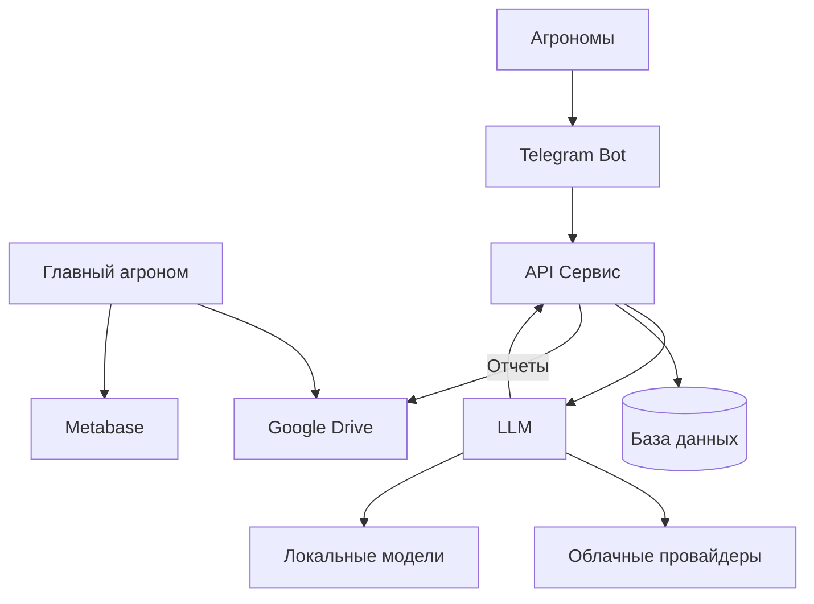

# АгроМейт - интеллектуальный ассистент для агрономов

**Команда**: Нейродрайв  
**Хакатон**: [LLM Coding Challenge](https://llm-challenge.com)  
  - [Памятка участника](https://publish.obsidian.md/llmhack/)
**Кейс**: ГК «Прогресс Агро» - Сервис структурирования сообщений от агрономов

## О проекте

АгроМейт - интеллектуальный ассистент для автоматизации сбора и структурирования полевых отчетов агрономов с использованием технологий искусственного интеллекта.

## Основные возможности

    📱 Автоматический сбор данных через Telegram-бота
    🤖 Извлечение структурированной информации из сообщений различных форматов
    📷 Обработка различных форматов входных данных: текст, фото, аудио
    🔍 Извлечение структурированных данных с изображений 
    🎤 Транскрибация голосовых сообщений в текст
    📊 Классификация и обработка данных с помощью LLM и VLM
    📝 Автоматическое заполнение сводных таблиц
    🔄 Экспорт отчетов в Google Drive
    ⏱️ Освобождение времени главного агронома от рутинных задач

## Демо

[Telegram Bot @AgromateBot](https://t.me/AgromateBot)


## Структура репозитория

```
/
├── agromate/               # Основной код приложения
│   ├── api/                # Основной сервис и API для клиентов по обработке сообщений
│   ├── clients/            # Различные клиенты (мессенджеры и веб-приложения)
│   │   ├── telegram-bot/   # Различные клиенты (мессенджеры и веб-приложения)
│   ├── data/               # Данные (справочники и конфигурационные файлы)
│
└── docs/               # Документация проекта
    ├── ai-usage/       # Использование AI в разработке
    ├── architecture/   # Архитектура системы
    ├── development/    # Руководство для разработчиков
    ├── plan/           # План и дорожная карта
    ├── requirements/   # Функциональные и технические требования
    ├── rules/          # Правила и критерии оценки
    └── user-guides/    # Руководство пользователя
```

## Архитектура

Подробное описание архитектуры системы доступно в [документации по архитектуре](docs/architecture/README.md).



Архитектура АгроМейт разработана с учетом принципов масштабируемости, читаемости и расширяемости. Проект структурирован по функциональным компонентам с четким разделением ответственности между модулями. Каждый компонент имеет собственную область задач, а взаимодействие между ними осуществляется через четко определенные интерфейсы. Такой подход обеспечивает гибкость при добавлении новых функций и возможность легкой модификации существующих компонентов без влияния на остальную систему.

### Основные компоненты системы

1. **Telegram Bot** — интерфейс взаимодействия с агрономами, принимает сообщения различных форматов (текст, фото, аудио) и передает их на обработку в API сервис.

2. **API Сервис** — центральный компонент системы, отвечающий за маршрутизацию данных, координацию обработки сообщений и взаимодействие с базой данных. Реализован на FastAPI для обеспечения высокой производительности и асинхронной обработки запросов. Содержит компоненты:
  - **Google Drive** — компонент для экспорта сформированных отчетов в формате, доступном для главного агронома.
  - **LLM Процессор** — компонент извлечения и структурирования данных из сообщений агрономов. Поддерживает:
      - **Облачные провайдеры** — интеграция с внешними API для обработки естественного языка (OpenAI GPT, Anthropic Claude и др.)
      - **Локальные модели** — возможность использования локально развернутых моделей для обеспечения конфиденциальности данных и работы без интернета

4. **База данных** — PostgreSQL для хранения структурированных данных, полученных из сообщений агрономов, метаданных и справочной информации.


## Стек технологий

- **Языки программирования**: Python 3.11+
- **Фреймворки и библиотеки**:
  - FastAPI - для создания API и основного сервиса
  - SQLModel/SQLAlchemy - ORM для работы с базой данных
  - Pydantic - для валидации данных
  - aiogram - для реализации Telegram-бота
  - python-dotenv - для управления переменными окружения
- **Базы данных**:
  - PostgreSQL
- **Инфраструктура**:
  - Docker и Docker Compose - для контейнеризации и оркестрации
  - Metabase - для визуализации и аналитики данных
- **Интеграции**:
  - Google Drive API - для экспорта отчетов
- **LLM и AI**:
  - Интеграция с LLM API для обработки и структурирования сообщений
- **Инструменты разработки**:
  - Poetry - управление зависимостями
  - Cursor, ChatGPT, Claude, Warp - AI-ассистенты для разработки


## Документация

- [Обзор проекта](./docs/requirements/overview.md) - Общее описание проблемы и предлагаемого решения
- [Требования](./docs/requirements/requirements.md) - Детальные функциональные и технические требования
- [Критерии оценки](./docs/rules/evaluation-criteria.md) - Критерии оценки для хакатона и информация о питчинге

## Использование инструментов на базе LLM

В процессе разработки активно используются AI Coding Assistant и другие инструменты на базе LLM. Подробная информация о применении этих инструментов доступна в [документации по использованию AI](./docs/ai-usage/README.md).


| № | Этап SDLC | Инструмент | Описание | Детали |
|---|-----------|------------|-----------|--------|
| 001 | Планирование | Cursor AI | Создание структуры проекта | [Подробнее](./docs/ai-usage/records/001-project-structure.md) |
| 002 | Все этапы | Cursor AI | Создание библиотеки LLM-промптов | [Подробнее](./docs/ai-usage/records/002-llm-prompts.md) |
| 003 | Планирование | Claude 3.7 | Анализ схемы процесса | [Подробнее](./docs/ai-usage/records/003-image-flowchart-analysis.md) |
| 004 | Проектирование | Claude 3.7 | Разработка архитектуры | [Подробнее](./docs/ai-usage/records/004-architecture-design.md) |
| 005 | Разработка | GPT-4 | Генерация Telegram-бота | [Подробнее](./docs/ai-usage/records/005-bot-implementation-gpt.md) |
| 006 | Разработка | GPT-4 | Генерация Dockerfile | [Подробнее](./docs/ai-usage/records/006-app-architecture-and-implementation.md) |
| 007 | DevOps | GPT-4 Turbo | Генерация docker-compose | [Подробнее](./docs/ai-usage/records/007-devops-gpt.md) |
| 008 | Разработка | GPT-4 Turbo | Генерация отчётов и интеграция с Google Drive | [Подробнее](./docs/ai-usage/records/008-google-drive-integration-development.md) |
| 009 | Реализация | Warp AI | AI-ассистированные операции в терминале | [Подробнее](./docs/ai-usage/records/009-warp-ai-terminal-usage.md) |
| 010 | Разработка | GPT-4 | Извлечение структурированной информации из сообщений | [Подробнее](./docs/ai-usage/records/010-llm-prompt-generation.md) |

[Видеозаписи](https://drive.google.com/drive/folders/1U-nVjNjhXb7g-xzYsbi8uhtAuxd3pLPQ?usp=sharing)

## Запуск проекта

### Предварительные требования

- [Docker](https://docs.docker.com/get-docker/)
- [Docker Compose](https://docs.docker.com/compose/install/)
- [Git](https://git-scm.com/downloads)

### Шаги для запуска

1. **Клонировать репозиторий**

```bash
git clone https://github.com/airndlab/hackathon-llm-coding-challenge-agromate
cd hackathon-llm-coding-challenge-agromate
```

2. **Настроить переменные окружения**

Создайте файл `.env` в корневой директории проекта:

```bash
cp .env.example .env
```

Отредактируйте файл `.env` и укажите необходимые параметры. 

3. **Запустить проект с помощью утилиты manage_services.sh**

Проект включает удобный скрипт для управления сервисами, расположенный в `scripts/manage_services.sh`. 
Перед использованием сделайте скрипт исполняемым:

```bash
chmod +x scripts/manage_services.sh
```

**Основные команды:**

```
./scripts/manage_services.sh build    # Собрать и запустить все сервисы
./scripts/manage_services.sh start    # Запустить все сервисы
./scripts/manage_services.sh stop     # Остановить все сервисы
./scripts/manage_services.sh restart  # Перезапустить все сервисы
./scripts/manage_services.sh health   # Проверить состояние всех сервисов
```

**Работа с логами:**

```
# Просмотр логов конкретного сервиса (app, bot, db, metabase)
./scripts/manage_services.sh logs <сервис> [количество_строк]

# Просмотр только ошибок в логах
./scripts/manage_services.sh errors [сервис] [количество_строк]
```

**Примеры:**

```bash
# Запуск всей инфраструктуры проекта
./scripts/manage_services.sh build

# Проверка здоровья всех сервисов
./scripts/manage_services.sh health

# Просмотр последних 50 строк логов Telegram-бота
./scripts/manage_services.sh logs bot 50

# Просмотр ошибок API сервиса
./scripts/manage_services.sh errors app
```

Все выполненные команды логируются в директории `./logs`, что помогает при отладке проблем с сервисами.
  
### Устранение неполадок

- Если у вас возникают проблемы с доступом к базе данных, убедитесь, что PostgreSQL запущен и доступен.
- Проверьте логи контейнеров для диагностики проблем: `docker compose logs -f`

## Использование LLM

### Облачные провайдеры

АгроМейт поддерживает интеграцию с различными облачными провайдерами LLM.
Для подключения к облачному провайдеру достаточно указать соответствующий API ключ и адрес в переменных окружения:

```bash
LLM_API_KEY=sk-...
LLM_API_BASE_URL=
```

### Локальный запуск

Для обеспечения конфиденциальности данных или работы без доступа к интернету, АгроМейт поддерживает использование локально развернутых LLM. Поддерживаются два основных инструмента:

#### vLLM

[vLLM](https://docs.vllm.ai) - высокопроизводительный сервер для запуска LLM, оптимизированный для эффективного использования GPU:

```bash
# Запуск vLLM в Docker
docker run --gpus all -p 8000:8000 vllm/vllm:latest \
  --model <model-name> \
  --tensor-parallel-size 1
```

Подробная инструкция: [https://docs.vllm.ai/en/latest/deployment/docker.html](https://docs.vllm.ai/en/latest/deployment/docker.html)

#### Ollama

[Ollama](https://ollama.com) - простой инструмент для локального запуска LLM на macOS, Windows и Linux:

1. Скачайте и установите Ollama: [https://ollama.com/download](https://ollama.com/download)
2. Запустите модель:
   ```bash
   ollama run mistramodel-namel
   ```

### Переключение между провайдерами

АгроМейт позволяет легко переключаться между облачными и локальными LLM, используя переменные окружения:

```bash
# Для подключения к локальному серверу vLLM или Ollama
LLM_API_BASE_URL=http://localhost:8000
LLM_API_KEY=no-key

# Указание модели
LLM_MODEL_NAME=mistral-7b
```

Это позволяет гибко выбирать подходящее решение в зависимости от требований к конфиденциальности данных, доступных вычислительных ресурсов и необходимого качества моделей.

## Конфигурирование

### Переменные окружения (.env)

Основная конфигурация приложения осуществляется через файл `.env`. Пример файла можно найти в `.env.example`:

```bash
# Базовые настройки
APP_ENV=development  # development или production
DEBUG=true           # режим отладки

# База данных
DB_HOST=db
DB_PORT=5432
DB_NAME=agromate
DB_USER=postgres
DB_PASSWORD=postgres

# Telegram Bot
TELEGRAM_BOT_TOKEN=your_telegram_bot_token

# API ключи для сервисов
OPENAI_API_KEY=your_openai_api_key


# Google Drive интеграция
GOOGLE_DRIVE_CREDENTIALS=path_to_credentials.json
GOOGLE_DRIVE_FOLDER_ID=your_folder_id
```

### Конфигурация моделей (models.yaml)

Файл `agromate/data/configs/models.yaml` содержит настройки AI моделей, используемых в проекте:

```yaml
llm_model_name: gpt-4.1          # Модель для основной обработки текста
ocr_model_name: gpt-4o           # Модель для распознавания текста с изображений
audio_model_name: whisper-1      # Модель для транскрибации аудио
```

Для использования альтернативных моделей (например, локальных или от других провайдеров) отредактируйте соответствующие параметры.

### Шаблоны промптов (prompts.yaml)

Файл `agromate/data/configs/prompts.yaml` содержит шаблоны промптов для работы с LLM:

```yaml
# Промпты для обработки сообщений агрономов
extract_field_report_system: |
  Ты - помощник агронома, извлекающий структурированную информацию из полевых отчетов.
  
# Промпты для классификации сообщений
message_classifier_system: |
  Классифицируй входящее сообщение по категориям: полевой_отчет, вопрос, спам, другое.

# Few-shot примеры для различных задач
field_report_few_shot_examples:
  - input: "Поле №42, пшеница, фаза кущения. Обнаружены сорняки, плотность 5 шт/м²."
    output: {...}
```

Для редактирования промптов рекомендуется использовать документацию по API используемых LLM-моделей для оптимального формирования инструкций.


## Метрики качества извлечения информации

Мы провели оценку качества извлечения структурированной информации из сообщений агрономов с использованием различных LLM моделей. Ниже представлены результаты тестирования на наборе из 106 полевых отчетов.

| Модель | 📊 Field Accuracy | 🎯 Exact Match | ⚖️ F1 Score | 🔍 Precision | 📈 Recall | 🏆 Accuracy по записям |
|--------|-------------------|---------------|------------|-------------|-----------|------------------------|
| DeepSeek v3 | 99.97% | 99.06% | 100.00% | 100.00% | 100.00% | 99.72% |
| Qwen 2.5 72b | 99.03% | 82.08% | 95.55% | 91.73% | 99.71% | 94.77% |
| Qwen 2.5 Coder 32b | 96.69% | 60.38% | 93.05% | 87.00% | 100.00% | 77.41% |

### Описание метрик

- **Field Accuracy**: Средняя точность распознавания по всем полям во всех записях
- **Exact Match**: Процент сообщений, в которых все поля были распознаны полностью правильно
- **F1 Score**: Гармоническое среднее между точностью и полнотой (идеальное значение - 100%)
- **Precision**: Отношение правильно извлеченных записей к общему количеству извлеченных записей
- **Recall**: Отношение правильно извлеченных записей к общему количеству истинных записей
- **Accuracy по записям**: Отношение правильно извлеченных записей к общему количеству истинных записей (total_correctly_matched_entries / total_true_entries)

Результаты показывают, что DeepSeek v3 демонстрирует наилучшую производительность по всем метрикам, практически достигая идеальных результатов при извлечении структурированной информации из полевых отчетов.
