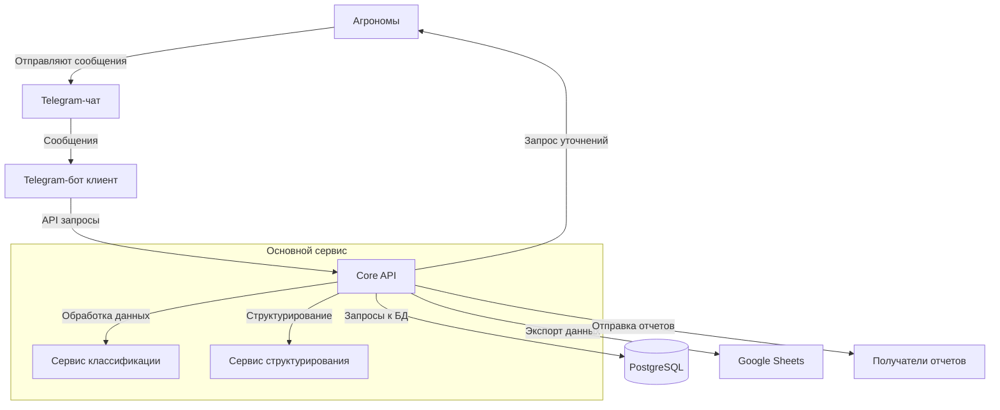

# Архитектура проекта "Сервис структурирования сообщений от агрономов"

## Обзор архитектуры

Архитектура проекта построена на принципах разделения ответственности, масштабируемости и простоты обслуживания. Система состоит из трех основных компонентов:

1. **Основное API (Core Backend)** - центральный компонент, отвечающий за бизнес-логику и обработку данных
2. **Telegram-бот (клиент)** - интерфейс взаимодействия с пользователями через Telegram
3. **База данных PostgreSQL** - хранилище для структурированных данных и метаданных

## Структура проекта

```
agromate/
├── api/                        # Основное API (Core Backend)
│   ├── core/                   # Ядро приложения
│   │   ├── config.py           # Конфигурация приложения
│   │   ├── dependencies.py     # Зависимости FastAPI
│   │   └── security.py         # Безопасность и авторизация
│   ├── db/                     # Работа с базой данных
│   │   ├── models.py           # Модели данных (SQLAlchemy)
│   │   ├── database.py         # Настройка подключения к БД
│   │   └── repositories/       # Репозитории для работы с данными
│   ├── services/               # Бизнес-логика сервисов
│   │   ├── message_service.py  # Обработка сообщений
│   │   ├── classifier.py       # Классификация и структурирование данных
│   │   └── sheets_service.py   # Интеграция с Google Sheets
│   ├── schemas/                # Схемы данных (Pydantic)
│   │   ├── message.py          # Схемы сообщений
│   │   └── report.py           # Схемы отчетов
│   ├── routes/                 # API эндпоинты
│   │   ├── messages.py         # Эндпоинты для работы с сообщениями
│   │   └── reports.py          # Эндпоинты для работы с отчетами
│   └── main.py                 # Точка входа FastAPI приложения
├── clients/                    # Клиентские приложения
│   └── telegram_bot/           # Телеграм-бот клиент
│       ├── handlers/           # Обработчики событий Telegram
│       ├── keyboards/          # Клавиатуры и интерфейс
│       ├── utils/              # Вспомогательные функции
│       └── bot.py              # Основной файл бота
├── data/                       # Данные проекта
│   ├── dictionaries/           # Справочники
│   │   ├── crops.json          # Список культур
│   │   ├── field_works.json    # Список полевых работ
│   │   └── departments.json    # Список подразделений
│   └── processed/              # Обработанные данные
├── migrations/                 # Миграции базы данных
├── tests/                      # Тесты
├── alembic.ini                 # Конфигурация Alembic для миграций
├── .env.example                # Пример переменных окружения
├── docker-compose.yml          # Конфигурация Docker Compose
├── requirements.txt            # Зависимости проекта
└── README.md                   # Документация проекта
```

## Диаграмма взаимодействия компонентов



## Описание компонентов

### Core API (Основное API)

Центральный компонент системы, построенный на FastAPI, отвечающий за:
- Получение и обработку данных от клиентов (Telegram-бота)
- Классификацию и структурирование сообщений
- Сохранение данных в PostgreSQL
- Экспорт данных в Google Sheets
- Формирование отчетов и уведомлений

API предоставляет следующие основные эндпоинты:
- `/api/messages` - работа с сообщениями от агрономов
- `/api/reports` - работа с отчетами и экспорт в Google Sheets
- `/api/dictionaries` - работа со справочниками (культуры, типы работ, подразделения)

### Telegram-бот (клиент)

Клиентское приложение, реализованное на python-telegram-bot, отвечающее за:
- Чтение сообщений из групповых чатов
- Отправку данных в Core API для обработки
- Отправку уведомлений и запросов уточнений
- Отправку готовых отчетов получателям

### База данных PostgreSQL

Реляционная СУБД для хранения:
- Оригинальных сообщений агрономов
- Структурированных данных после обработки
- Справочников и метаданных
- Истории обработки и экспорта

## Технологический стек

- **Backend**: Python 3.9+, FastAPI
- **База данных**: PostgreSQL, SQLAlchemy (ORM), Alembic (миграции)
- **Клиент**: python-telegram-bot
- **Интеграции**: Google API Client (для Google Sheets)
- **Контейнеризация**: Docker, Docker Compose
- **Тестирование**: pytest

## Обоснование выбранной архитектуры

Выбранная трехслойная архитектура (API-сервер, Telegram-бот и PostgreSQL) идеально соответствует требованиям проекта по следующим причинам:

### Соответствие бизнес-требованиям

1. **Разделение ответственности** - четкое разграничение функций сбора данных (бот), обработки (API) и хранения (БД) обеспечивает надежность и упрощает отладку каждого компонента.

2. **Автоматизация процесса** - архитектура позволяет полностью автоматизировать цикл от получения неструктурированных данных до формирования готовых отчетов без ручного вмешательства.

3. **Обработка разных форматов** - выделение логики обработки в отдельный сервис API позволяет гибко расширять поддержку различных форматов сообщений.

### Технологические преимущества

1. **FastAPI для API-сервера**:
   - Высокая производительность обработки запросов
   - Встроенная документация OpenAPI
   - Асинхронная обработка для эффективной работы с I/O операциями
   - Простота разработки и тестирования

2. **Python-telegram-bot для клиента**:
   - Полная поддержка Telegram API
   - Возможность обработки медиафайлов и сообщений любого формата
   - Простота интеграции с основным API

3. **PostgreSQL для хранения данных**:
   - Поддержка сложных запросов и JSONB для гибкого хранения
   - Транзакционность и целостность данных
   - Возможность масштабирования
   - Полнотекстовый поиск для анализа сообщений

### Преодоление технических вызовов

1. **Обработка неструктурированных данных** - сервис классификации в API-сервере может использовать современные методы NLP для анализа текста сообщений.

2. **Согласование словарей** - централизованное хранение справочников в PostgreSQL позволяет эффективно сопоставлять термины с их стандартизованными вариантами.

3. **Асинхронный рабочий процесс** - обработка сообщений может происходить асинхронно, что важно при пиковых нагрузках в конце рабочего дня.

4. **Надежность экспорта** - отделение логики экспорта в Google Sheets в отдельный сервис обеспечивает устойчивость при сбоях интеграции.

### Масштабируемость и развитие

1. **Горизонтальное масштабирование** - возможность запуска нескольких экземпляров API и ботов с балансировкой нагрузки.

2. **Добавление новых клиентов** - архитектура позволяет легко добавлять новые интерфейсы (например, веб-приложение) без изменения core API.

3. **Расширение функциональности** - модульная структура облегчает добавление новых возможностей, таких как аналитика или ML-модели для улучшения классификации.

4. **Поэтапное внедрение** - архитектура позволяет начать с минимально работоспособного продукта и последовательно расширять функциональность.

### Сравнение с альтернативами

1. **Монолитное приложение** - уступает в гибкости и масштабируемости, становится сложным в поддержке при расширении функциональности.

2. **Микросервисная архитектура** - избыточна для текущего масштаба задачи, создает дополнительную сложность распределенного взаимодействия.

3. **Serverless-архитектура** - хотя и масштабируема, но менее подходит для постоянно работающих процессов обработки сообщений и может привести к более высоким затратам.

## Преимущества архитектуры

1. **Разделение ответственности**: каждый компонент отвечает за свою часть функциональности
2. **Масштабируемость**: возможность добавления новых клиентов (например, веб-интерфейс) без изменения основной логики
3. **Простота обслуживания**: модульная структура облегчает поддержку и развитие системы
4. **Устойчивость**: компоненты могут работать и восстанавливаться независимо друг от друга
5. **Гибкость**: возможность расширения функциональности без полной перестройки системы

## Процесс обработки данных

1. Telegram-бот получает сообщения от агрономов в групповом чате
2. Бот отправляет сообщения в Core API через POST запрос к `/api/messages`
3. Core API сохраняет исходное сообщение в базу данных
4. Сервис классификации анализирует содержимое сообщения, выделяя ключевые параметры
5. Сервис структурирования формирует структурированные данные, используя справочники
6. Структурированные данные сохраняются в базу данных
7. Сервис экспорта формирует таблицу в Google Sheets
8. Сервис уведомлений отправляет отчеты получателям через Telegram-бота

## Развертывание

Проект настроен для развертывания с использованием Docker Compose, что обеспечивает изоляцию компонентов и упрощает масштабирование. Каждый компонент (API, Telegram-бот, PostgreSQL) запускается в отдельном контейнере.

## Дальнейшее развитие

Архитектура предусматривает возможность расширения:
- Добавление веб-интерфейса для администрирования
- Интеграция с аналитическими системами
- Реализация микросервисной архитектуры при необходимости масштабирования
- Добавление новых источников данных и форматов сообщений 