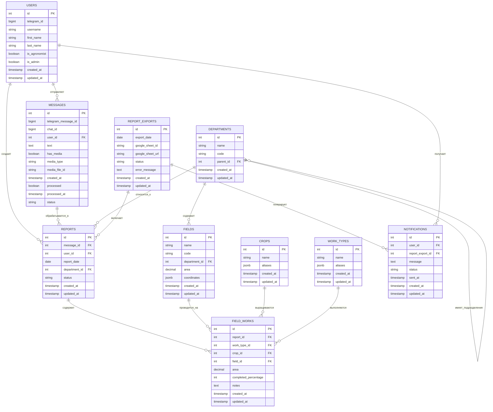

# Схема базы данных PostgreSQL

## Обзор базы данных

База данных PostgreSQL выбрана как основное хранилище для проекта "Сервис структурирования сообщений от агрономов" благодаря её надежности, производительности и поддержке сложных запросов. Схема базы данных спроектирована с учетом специфики хранения как исходных сообщений агрономов, так и структурированных данных после обработки.

## Основные таблицы

### 1. Пользователи (users)

```sql
CREATE TABLE users (
    id SERIAL PRIMARY KEY,
    telegram_id BIGINT UNIQUE NOT NULL,
    username VARCHAR(255),
    first_name VARCHAR(255),
    last_name VARCHAR(255),
    is_agronomist BOOLEAN DEFAULT FALSE,
    is_admin BOOLEAN DEFAULT FALSE,
    created_at TIMESTAMP WITH TIME ZONE DEFAULT NOW(),
    updated_at TIMESTAMP WITH TIME ZONE DEFAULT NOW()
);
```

Таблица для хранения информации о пользователях системы (агрономах и администраторах).

### 2. Сообщения (messages)

```sql
CREATE TABLE messages (
    id SERIAL PRIMARY KEY,
    telegram_message_id BIGINT,
    chat_id BIGINT NOT NULL,
    user_id INTEGER REFERENCES users(id),
    text TEXT,
    has_media BOOLEAN DEFAULT FALSE,
    media_type VARCHAR(50),
    media_file_id VARCHAR(255),
    created_at TIMESTAMP WITH TIME ZONE NOT NULL,
    processed BOOLEAN DEFAULT FALSE,
    processed_at TIMESTAMP WITH TIME ZONE,
    status VARCHAR(50) DEFAULT 'new',
    UNIQUE(telegram_message_id, chat_id)
);
```

Таблица для хранения исходных сообщений, полученных из Telegram. Включает текст сообщения и метаданные.

### 3. Обработанные отчеты (reports)

```sql
CREATE TABLE reports (
    id SERIAL PRIMARY KEY,
    message_id INTEGER REFERENCES messages(id),
    user_id INTEGER REFERENCES users(id),
    report_date DATE NOT NULL,
    department_id INTEGER REFERENCES departments(id),
    status VARCHAR(50) DEFAULT 'processed',
    created_at TIMESTAMP WITH TIME ZONE DEFAULT NOW(),
    updated_at TIMESTAMP WITH TIME ZONE DEFAULT NOW()
);
```

Таблица для хранения обработанных отчетов, полученных из сообщений агрономов.

### 4. Полевые работы (field_works)

```sql
CREATE TABLE field_works (
    id SERIAL PRIMARY KEY,
    report_id INTEGER REFERENCES reports(id),
    work_type_id INTEGER REFERENCES work_types(id),
    crop_id INTEGER REFERENCES crops(id),
    field_id INTEGER REFERENCES fields(id),
    area DECIMAL(10, 2),
    completed_percentage INTEGER,
    notes TEXT,
    created_at TIMESTAMP WITH TIME ZONE DEFAULT NOW(),
    updated_at TIMESTAMP WITH TIME ZONE DEFAULT NOW()
);
```

Таблица для хранения информации о полевых работах, извлеченной из сообщений агрономов.

### 5. Подразделения (departments)

```sql
CREATE TABLE departments (
    id SERIAL PRIMARY KEY,
    name VARCHAR(255) NOT NULL,
    code VARCHAR(50),
    parent_id INTEGER REFERENCES departments(id),
    created_at TIMESTAMP WITH TIME ZONE DEFAULT NOW(),
    updated_at TIMESTAMP WITH TIME ZONE DEFAULT NOW()
);
```

Справочник подразделений компании с иерархической структурой.

### 6. Поля (fields)

```sql
CREATE TABLE fields (
    id SERIAL PRIMARY KEY,
    name VARCHAR(255) NOT NULL,
    code VARCHAR(50),
    department_id INTEGER REFERENCES departments(id),
    area DECIMAL(10, 2),
    coordinates JSONB,
    created_at TIMESTAMP WITH TIME ZONE DEFAULT NOW(),
    updated_at TIMESTAMP WITH TIME ZONE DEFAULT NOW()
);
```

Справочник полей с привязкой к подразделениям.

### 7. Культуры (crops)

```sql
CREATE TABLE crops (
    id SERIAL PRIMARY KEY,
    name VARCHAR(255) NOT NULL UNIQUE,
    aliases JSONB, -- массив альтернативных названий для поиска
    created_at TIMESTAMP WITH TIME ZONE DEFAULT NOW(),
    updated_at TIMESTAMP WITH TIME ZONE DEFAULT NOW()
);
```

Справочник сельскохозяйственных культур.

### 8. Типы работ (work_types)

```sql
CREATE TABLE work_types (
    id SERIAL PRIMARY KEY,
    name VARCHAR(255) NOT NULL UNIQUE,
    aliases JSONB, -- массив альтернативных названий для поиска
    created_at TIMESTAMP WITH TIME ZONE DEFAULT NOW(),
    updated_at TIMESTAMP WITH TIME ZONE DEFAULT NOW()
);
```

Справочник типов полевых работ.

### 9. Экспорты отчетов (report_exports)

```sql
CREATE TABLE report_exports (
    id SERIAL PRIMARY KEY,
    export_date DATE NOT NULL,
    google_sheet_id VARCHAR(255),
    google_sheet_url VARCHAR(255),
    status VARCHAR(50) DEFAULT 'pending',
    error_message TEXT,
    created_at TIMESTAMP WITH TIME ZONE DEFAULT NOW(),
    updated_at TIMESTAMP WITH TIME ZONE DEFAULT NOW()
);
```

Таблица для отслеживания экспорта отчетов в Google Sheets.

### 10. Уведомления (notifications)

```sql
CREATE TABLE notifications (
    id SERIAL PRIMARY KEY,
    user_id INTEGER REFERENCES users(id),
    report_export_id INTEGER REFERENCES report_exports(id),
    message TEXT,
    status VARCHAR(50) DEFAULT 'pending',
    sent_at TIMESTAMP WITH TIME ZONE,
    created_at TIMESTAMP WITH TIME ZONE DEFAULT NOW(),
    updated_at TIMESTAMP WITH TIME ZONE DEFAULT NOW()
);
```

Таблица для отслеживания отправленных уведомлений о готовых отчетах.

## Индексы

Для оптимизации производительности создаются следующие индексы:

```sql
CREATE INDEX idx_messages_user_id ON messages(user_id);
CREATE INDEX idx_messages_created_at ON messages(created_at);
CREATE INDEX idx_messages_status ON messages(status);
CREATE INDEX idx_reports_report_date ON reports(report_date);
CREATE INDEX idx_reports_user_id ON reports(user_id);
CREATE INDEX idx_field_works_report_id ON field_works(report_id);
CREATE INDEX idx_crops_name ON crops(name);
CREATE INDEX idx_work_types_name ON work_types(name);
```

## Диаграмма отношений



## Миграции

Для управления схемой базы данных используется Alembic - инструмент миграции баз данных для SQLAlchemy. Это позволяет:

1. Отслеживать изменения в схеме БД
2. Применять изменения в порядке их создания
3. Откатывать изменения при необходимости
4. Автоматически генерировать миграции на основе изменений моделей SQLAlchemy

## Преимущества выбранной схемы

1. **Целостность данных** - использование ограничений и внешних ключей гарантирует согласованность данных
2. **Нормализация** - схема нормализована для минимизации избыточности данных
3. **Поддержка справочников** - отдельные таблицы для справочной информации упрощают поддержку
4. **Отслеживание состояния** - все сущности имеют статусы и временные метки
5. **Производительность** - оптимизирована для частых операций чтения и записи

## Настройка развертывания

База данных развертывается в контейнере Docker с использованием Docker Compose. Для инициализации базы данных используются миграции Alembic, которые применяются автоматически при запуске контейнера. 